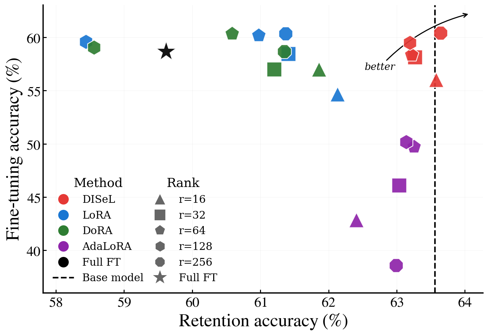
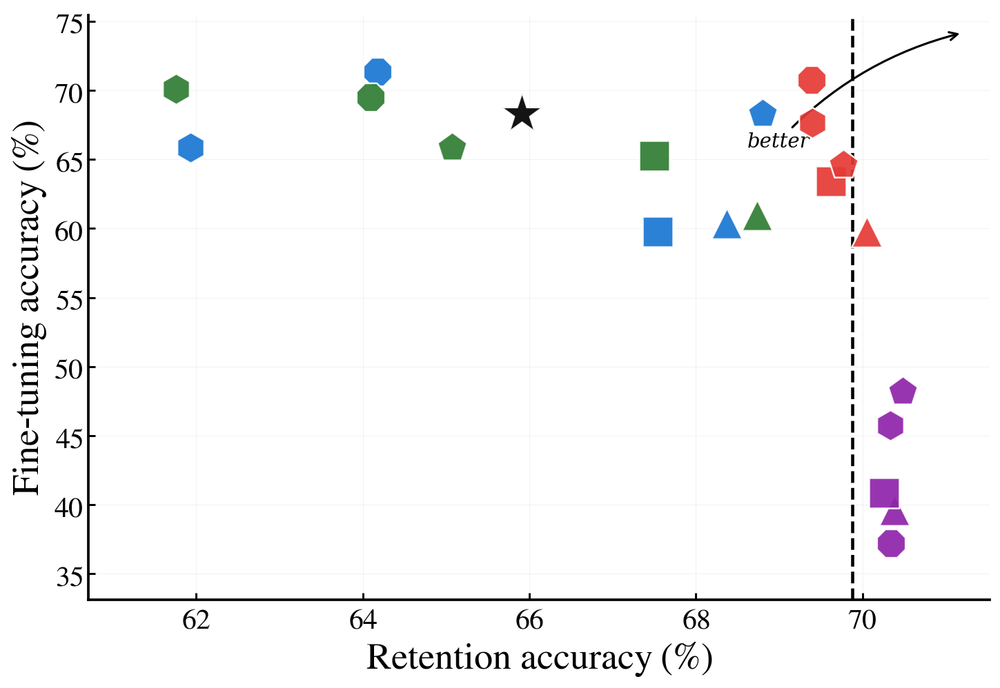
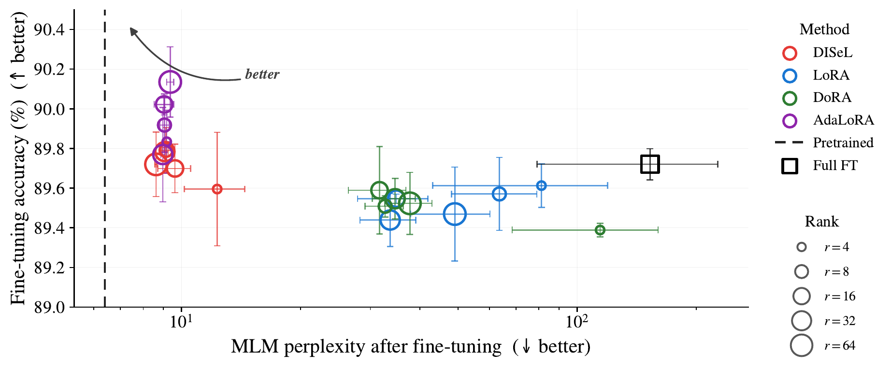

<div align="center">

# DISeL

### *Fine-tuning with near-zero forgetting*

[](LICENSE)
[](https://www.python.org)
[](https://pytorch.org)
[](https://github.com/huggingface/peft)
[](#citation)




<em><strong>Left:</strong> LLaMA-2-7B on MetaMathQA (GSM8K accuracy vs. retention
on 14 held-out benchmarks). <strong>Right:</strong> Mistral-7B on
Magicoder-Evol-Instruct-110K (HumanEval pass@1 vs. the same retention suite).
In both cases <strong>DISeL (red)</strong> sits on the base-model retention line
while matching the strongest fine-tuning accuracy; every other adapter family
either forgets visibly (LoRA / DoRA / Full FT) or loses accuracy to preserve
retention (AdaLoRA).</em>

</div>

---

**DISeL** (*Dynamic Input-Sensitive LoRA*) makes LoRA's correction
**input-dependent**.

Standard LoRA learns a single low-rank correction $\Delta W = AB$ and adds it
to the frozen weight on *every* input. Because the same update is applied
everywhere, fine-tuning has to compromise between (i) adapting on inputs that
look like the fine-tuning data and (ii) preserving the pre-trained mapping
elsewhere — a structural source of catastrophic forgetting.

DISeL keeps the rank-$r$ factorisation but multiplies each rank-one component
by an input-dependent sigmoid gate:

$$
f(x) = A G(x) B x = \sum_{i=1}^{r} g_i(x) a_i b_i^\top x
$$

$$
g(x) = \sigma(W_g x + b_g) \in (0,1)^r
$$

Two properties follow directly from the parameterisation:

1. **The model starts at the pre-trained mapping.** Initialising $b_g$ to a
   small negative value (we use $-3$, so $\sigma(-3) \approx 0.05$) closes
   every gate at step 0, and combined with LoRA's standard zero-init on $B$
   this means $f(x)=0$ everywhere. Adaptation only kicks in when some gate
   learns to open.
2. **Gates open only where opening reduces the fine-tuning loss.** Each gate
   is an independent soft switch (sigmoid, not softmax), so multiple ranks
   can open at once and out-of-distribution tokens can keep them all closed.
   In practice the gates do exactly that — see the paper's interpretability
   section for histograms by input domain and module type.

The gate adds $r d_x + r$ parameters per adapted layer (negligible next to
$A, B$) and a single matrix-vector product per forward pass. Because gate
learning is a qualitatively different task from refining $A, B$, we train it
with its own (larger) learning rate — by default $5\times$ the LoRA learning
rate — exposed as a separate optimiser group.

This repository is the minimal reference implementation that accompanies the
paper. It ships as a `pip install disel`-able package built on top of
HuggingFace [`peft`](https://github.com/huggingface/peft) and
[`transformers`](https://github.com/huggingface/transformers); we plan to
upstream the method as a `use_disel=True` flag on `LoraConfig` once the API
shape settles (see "Upstreaming" below).

## Key hyperparameters

DISeL has only a handful of knobs beyond standard LoRA. The defaults below are
the ones we use in the paper unless noted; the trade-off they control is the
same in every case (lower gate values + smaller gate LR → less adaptation, more
retention; higher → more adaptation, more forgetting).

### Gate bias initialisation `b_g`

The gate value at initialisation is $\sigma(b_g)$. Setting $b_g$ to a small
negative number makes every gate start nearly closed, so the LoRA branch is
effectively off everywhere at step 0 and the model behaves like the pre-trained
base. The gates then *learn to open* only on inputs where opening reduces the
fine-tuning loss.

- **Default: $b_g = -3$** ($\sigma(-3) \approx 0.05$). This is what we use
  for all LLaMA-2-7B and Mistral-7B experiments.
- **More conservative starts (`b_g = -5` or `-7`) help on small datasets**,
  where you want to preserve pre-training more strongly and rely on the gate
  LR to selectively unlock the directions that matter. In the paper we use
  $b_g = -7$ for most RoBERTa-on-GLUE tasks (MNLI, SST-2, QNLI), and a less
  negative bias only on the smallest tasks (CoLA, MRPC) where the gates need
  to open faster.

### Gate weight initialisation `W_g`

We initialise $W_g$ with the **Kaiming-uniform scheme** (He et al., 2015) — the
PyTorch `nn.Linear` default. Note that *random* (small but non-zero) weights
are what we want here, not zeros: the gate value at init is determined by
$b_g$ (so it stays near zero), but $W_g$ being random means the gate is
*input-dependent from step 0*. Combined with LoRA's standard $B = 0$ init,
this gives $f(x) = 0$ for every $x$ at step 0 while still allowing useful
gradients to flow into $W_g$ as soon as $B$ moves off zero.

The package also exposes `disel_gate_weight_init="zero"` for ablations; it
zeros $W_g$ so the gate starts as a constant $\sigma(b_g)$. Don't use this for
real runs — without input dependence the gate cannot route adaptation by input.

### Gate learning rate

Gate parameters $(W_g, b_g)$ are trained jointly with $(A, B)$ but they are
solving a **qualitatively different** problem: learning to distinguish
fine-tuning inputs from the rest of the input space. That is more like
representation learning during pre-training than fine refinement of a linear
map, so it benefits from a larger learning rate.

- **Paper recipe (LLaMA / Mistral): gate LR $= 10^{-3}$**, which is
  $\mathbf{5\times}$ the LoRA learning rate of $2\times 10^{-4}$.
  Exposed as `gate_lr_multiplier=5.0` (default) on `build_optimizer`.
- **RoBERTa-on-GLUE**: gate LR is $10^{-4}$ on large tasks (MNLI, SST-2, QNLI)
  and $10^{-3}$ on small ones (CoLA, MRPC). The latter need a higher gate LR
  to overcome the conservative $b_g = -7$ init.

The gate learning rate is the main knob you have for the *plasticity vs.
retention* trade-off: a larger gate LR encourages more gates to open and
favours adaptation, a smaller gate LR keeps more directions closed and
favours retention.

### Weight decay on $W_g$ is disabled

A subtle but important point: $W_g$ must be **excluded from weight decay**.
Decaying $W_g$ pushes it toward zero, which would collapse the gate to a
constant $\sigma(b_g)$ and remove the input dependence. `build_optimizer`
puts the gate parameters in their own AdamW group with `weight_decay=0.0`;
if you write your own optimiser, do the same.

## Install

```bash
pip install -e .
# or, with the example training scripts:
pip install -e ".[examples]"
```

Python ≥ 3.10, `torch ≥ 2.1`, `transformers ≥ 4.40`, `peft ≥ 0.13, < 0.20`.

## Quickstart

```python
import torch
from transformers import AutoModelForCausalLM
from peft import get_peft_model
import disel

model = AutoModelForCausalLM.from_pretrained(
    "meta-llama/Llama-2-7b-hf", torch_dtype=torch.bfloat16,
)

config = disel.DiselConfig(
    r=64,
    lora_alpha=128,
    target_modules="all-linear",
    lora_dropout=0.0,
    bias="none",
    task_type="CAUSAL_LM",
    disel_gate_bias_init=-3.0,   # gates start ~closed
    disel_gate_normalize=False,
    disel_gate_weight_init="random",
)
model = get_peft_model(model, config)
disel.enable_disel(model, config)        # attach gates to every LoRA layer
model.print_trainable_parameters()

optimizer = disel.build_optimizer(
    model, base_lr=2e-4, gate_lr=1e-3, weight_decay=0.01,
)
# Plug `optimizer` into HuggingFace Trainer or your loop. See examples/.
```

`enable_disel` adds a `lora_disel_gate` `ModuleDict` to every PEFT `LoraLayer`
and registers a `LoraVariant` so PEFT's forward path routes through the DISeL
computation. The `lora_` prefix on the ModuleDict name matches the convention
DoRA uses (`lora_magnitude_vector`) and is what triggers PEFT's state-dict
serialiser to include the gate parameters — so saving with the standard
`model.save_pretrained(...)` writes them into the same
`adapter_model.safetensors` as the LoRA matrices.

### Saving and loading

Saving is just the standard PEFT call:

```python
model.save_pretrained("checkpoints/disel_run")
```

Loading needs three steps in a specific order, because vanilla PEFT does not
know about DISeL: (1) PEFT rebuilds the LoRA layers, (2) we attach fresh
gates, (3) we re-apply the saved state dict to populate the gates. We expose
`disel.from_pretrained` to do all three in one call:

```python
from transformers import AutoModelForCausalLM
import disel

base = AutoModelForCausalLM.from_pretrained(
    "meta-llama/Llama-2-7b-hf", torch_dtype=torch.bfloat16,
)
model = disel.from_pretrained(base, "checkpoints/disel_run")
model.eval()
```

If you prefer to assemble the pieces manually (e.g. you already called
`PeftModel.from_pretrained` from your own pipeline), use the lower-level
helper:

```python
peft_model = PeftModel.from_pretrained(base, "checkpoints/disel_run")
disel.enable_disel(peft_model, config)              # attach fresh gates
disel.load_gate_state_dict(peft_model, "checkpoints/disel_run")  # fill them
```

Naively calling `PeftModel.from_pretrained` *without* the second/third step
silently leaves the gates at their fresh init — covered by
`tests/test_disel.py::test_save_load_round_trip`, which asserts bit-exact
parameter round-trips and matching forward passes.

## Results

The hero figure above covers the two large-scale settings: **mathematical
reasoning** (LLaMA-2-7B / MetaMathQA, evaluated on GSM8K) and **code
generation** (Mistral-7B / Magicoder, evaluated on HumanEval pass@1). In both,
DISeL crosses the base-model retention line at the largest ranks while
matching the strongest fine-tuning accuracy: LoRA and DoRA give up 2–5 points
of retention for similar accuracy, AdaLoRA preserves retention but drops 10+
accuracy points, and Full FT moves several points to the left of the retention
line.

The same picture also holds on a much smaller architecture (RoBERTa-base on
five GLUE tasks), where the appropriate retention metric is masked-LM
perplexity on three out-of-domain corpora rather than benchmark accuracy:

<div align="center">

<br/>
<em>RoBERTa-base fine-tuned on five GLUE tasks (MNLI, SST-2, QNLI, CoLA,
MRPC). DISeL keeps masked-LM perplexity near the pre-trained baseline
(dashed line, ≈ 6.4) while matching the accuracy of AdaLoRA and Full FT;
LoRA, DoRA, and especially Full FT shift one to two decades to the right on
the perplexity axis.</em>
</div>

## What is and isn't supported

| Feature | Status |
|---|---|
| `target_modules="all-linear"` | ✅ via the underlying `LoraConfig` |
| `target_modules=[...]` (explicit list) | ✅ |
| Saving / loading via PEFT | ✅ (gates are in `adapter_layer_names`) |
| `model.disable_adapter()` | ✅ |
| `model.merge_and_unload()` | ❌ `NotImplementedError` — the gate is input-dependent, so there is no fixed `ΔW` to fold into the base weight |
| Quantised backends (bnb 4-/8-bit) | Experimental — works at fp16/bf16 master weights, no special quant kernel |
| Multi-adapter (`add_adapter`) | ✅ — call `enable_disel(model, config, adapter_name=...)` for each |

## Reproducing the paper

See `examples/` for runnable scripts and `examples/README.md` for the exact
hyperparameters used in the paper tables. The two main recipes are
`train_metamath.py` (LLaMA-2-7B on MetaMathQA) and the matching
HumanEval/Magicoder recipe (coming soon).

## Repository layout

```
disel/
├── __init__.py        # public API
├── config.py          # DiselConfig (subclass of LoraConfig)
├── layer.py           # RankGate / LightRankGate nn.Module
├── variant.py         # DiselLinearVariant (shaped like PEFT's DoraLinearVariant)
└── integration.py     # enable_disel(...) and build_optimizer(...)
examples/
└── train_metamath.py
tests/
└── test_disel.py
```

## Upstreaming

The variant class in `disel/variant.py` is intentionally shaped to drop in to
[`src/peft/tuners/lora/variants.py`](https://github.com/huggingface/peft/blob/main/src/peft/tuners/lora/variants.py)
next to `DoraLinearVariant`. Doing so requires (a) a new flag on `LoraConfig`
(`use_disel`), (b) one extra branch in
`Linear.resolve_lora_variant` / `Embedding.resolve_lora_variant`, and (c) a
test-matrix entry in `tests/test_custom_models.py`. See
[PR #1474 (DoRA)](https://github.com/huggingface/peft/pull/1474),
[PR #1838 (FourierFT)](https://github.com/huggingface/peft/pull/1838), and
[PR #1864 (HRA)](https://github.com/huggingface/peft/pull/1864) for the
canonical contribution flow.

## Citation

Coming soon.

## License

Apache-2.0 — see [LICENSE](LICENSE).
